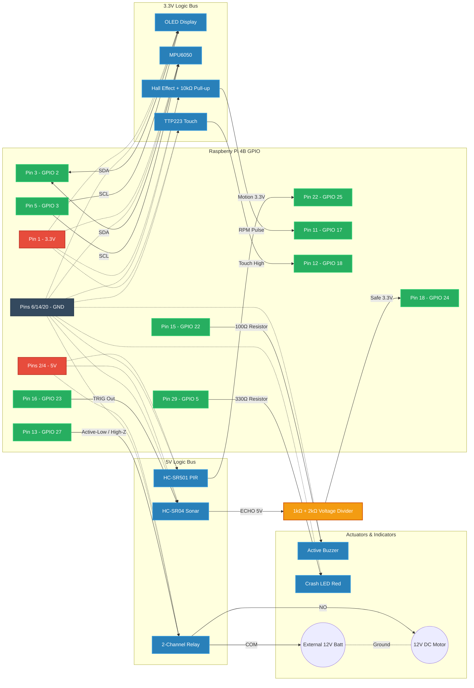

# Software-Defined-Vehicle-Cockpit-Safety
Software-Defined Vehical &amp; Cockpit Safety system on a Raspberry Pi 4 running the QNX real-time operating system. It uses multi-core processing to completely isolate a infotainment display from an autonomous braking system, ensuring that heavy UI graphics can never delay sensor fusion or safety-critical motor responses.

-A8B9CC?style=flat-square)

This project is a bare-metal, real-time Software-Defined Vehicle (SDV) architecture focused on **Cockpit Safety**, built on the **QNX Microkernel**. It demonstrates true mixed-criticality by sandboxing heavy infotainment graphics, high-speed telemetry, and zero-latency autonomous braking across dedicated ARM Cortex-A72 cores.

## System Architecture

The system utilizes QNX's `ThreadCtl` and POSIX scheduling to strictly pin processes to specific CPU cores, ensuring that non-critical systems (like the UI) can never steal execution time from safety-critical systems (like the brakes).

| Core | Subsystem | Scheduling | Priority | Responsibility |
| :--- | :--- | :--- | :--- | :--- |
| **Core 0** | `Infotainment` | `SCHED_RR` | p=10 | Renders 3D starfield & HUD on OLED via I2C. |
| **Core 1** | `Telemetry` | `SCHED_RR` | p=15 | Polls Hall Effect (RPM) and MPU6050 (Impacts). |
| **Core 2** | `HAM Watchdog` | `SCHED_FIFO` | p=40 | 0% CPU Watchdog. Resurrects crashed safety systems. |
| **Core 3** | `Guardian` | `SCHED_FIFO` | p=63 | Receives IPC pulses; actuates motor relay & brakes. |

### High-Availability Manager (HAM)
Core 2 runs a High-Availability Manager that actively supervises the Core 3 Guardian process. If the safety system crashes (e.g., due to a memory fault), the HAM detects the `SIGSEGV` and instantly resurrects the braking system within milliseconds, before the vehicle can physically react.

## Hardware & Sensor Fusion

The system reads directly from the **BCM2711 GPIO registers** via `mmap_device_io` to achieve sub-microsecond latency, completely bypassing standard high-level Linux drivers.

### Sensors Used
* **HC-SR04 Ultrasonic Sensor:** Acts as the primary proximity "eye" for autonomous braking, constantly scanning for obstacles under 10cm.
* **HC-SR501 PIR Motion Sensor:** Acts as the motion "guard" to confirm human presence before braking, eliminating false positives in the sensor fusion algorithm.
* **MPU6050 6-DoF Accelerometer/Gyroscope:** Monitors vehicle inertia via I2C and detects high-G impacts (>3000 threshold) to trigger the last-resort crash failsafe.
* **HW-484 Hall Effect Sensor:** Measures the magnetic pulses of the motor/wheel assembly to calculate real-time RPM for the telemetry dashboard.
* **TTP223 Capacitive Touch Sensor:** Serves as the highest-priority physical hardware interrupt (`SCHED_FIFO p=63`) to manually toggle the motor state.
  
### Actuators & Logic
* **Autonomous Braking (Sensor Fusion):** The logic requires BOTH the PIR (Motion) and Ultrasonic (Proximity) to trigger simultaneously before firing an IPC pulse to cut motor power.
* **Failsafe Relay:** The motor is wired to the `Normally Open (NO)` terminal of a 5V relay. The QNX software uses a high-impedance hardware trick to hold the circuit closed. If the OS panics or loses power, the relay snaps open, instantly stopping the motor.

### Wiring Matrix
| Component | Signal | Pi Physical Pin | Notes |
| :--- | :--- | :--- | :--- |
| **OLED (I2C)** | SDA / SCL | Pin 3 / 5 | Shared I2C1 Bus. |
| **MPU6050 (I2C)** | SDA / SCL | Pin 3 / 5 | Shared I2C1 Bus (Add### Actuators & Logic
* **Autonomous Braking (Sensor Fusion):** The logic requires BOTH the PIR (Motion) and Ultrasonic (Proximity) to trigger simultaneously before firing an IPC pulse to cut motor power.
* **Failsafe Relay:** The motor is wired to the `Normally Open (NO)` terminal of a 5V relay. The QNX software uses a high-impedance hardware trick to hold the circuit closed. If the OS panics or loses power, the relay snaps open, instantly stopping the motor.
ress `0x68`). |
| **Ultrasonic** | TRIG / ECHO | Pin 16 / 18 | **ECHO requires 1kΩ/2kΩ voltage divider.** |
| **PIR Sensor** | OUT | Pin 22 | Native 3.3V logic. |
| **Hall Effect** | OUT | Pin 11 | Requires 10kΩ pull-up to 3.3V. |
| **Touch Sensor** | OUT | Pin 12 | Highest priority interrupt (FIFO p=63). |
| **Motor Relay** | IN1 | Pin 13 | Active-LOW, requires 5V VCC on coil. |
| **Buzzer** | (+) | Pin 15 | Requires 100Ω series resistor. |

### ⚡ Hardware Wiring Schematic

## Build & Deployment

### Prerequisites
* Raspberry Pi 4B flashed with **QNX SDP 8.0**.
* Network/SSH access to the QNX target as `qnxuser` or `root`.
* **QNX Momentics IDE** (Recommended for deployment and debugging).

### Compilation Using QNX Momentics IDE
1. Open the QNX Momentics IDE.
2. Select **File > Import > General > Existing Projects into Workspace**.
3. Browse to this repository's folder and click **Finish**.
4. Right-click the project in the Project Explorer and select **Properties > QNX C/C++ Project**. Ensure the Build Architecture is set to **aarch64le**.
5. Click the **Build** hammer icon. 
6. Set up a Target connection to your Raspberry Pi and deploy the binary directly via the IDE's Run/Debug Configurations.
